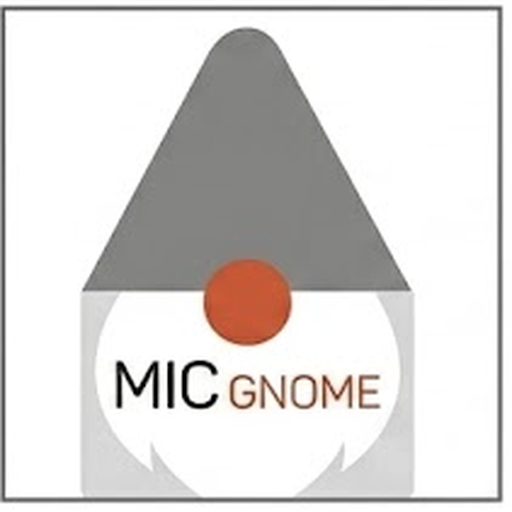

# Mic Gnome



A browser patch bay for the [Teenage Engineering EP–2350 fx-mic](https://teenage.engineering/guides/ep-2350).
Hear it before you eject it.

Not affiliated with Teenage Engineering.

## Why

The fx-mic mounts over USB-C as a FAT disk. You drop `1.wav`–`4.wav` and a `config.json`
onto it, eject, and the mic restarts with new sounds. That `config.json` is the whole
instrument — four effect chains, ten effect blocks, and rules for how the handle,
the accelerometer and an LFO push parameters around while you perform.

It is also a text file with no safety net. The guide says it plainly: break the syntax
and the unit will not start, a missing comma is the number one cause, and recovery means
holding **white + grey** on boot to get the disk back.

So the brief is two sentences:

1. Never let the user write a file that stops the mic booting.
2. Let them hear the preset before it leaves the browser.

## Where it is

**Phase 0 — the safety net.** In progress.

| module | what it does | state |
| --- | --- | --- |
| `src/fxmic/spec.ts` | the device: 10 effects, every parameter and published range, limits, playmodes, LFO shapes | done |
| `src/fxmic/validate.ts` | the validator — errors where the guide is explicit, warnings where it is silent | done |
| `src/fxmic/parse.ts` | the lenient importer — opens files the device would reject, reports every repair | done |
| `src/fxmic/serialize.ts` | canonical `config.json`, plus the handle-map curve | done |
| `src/fxmic/store.ts` | one file-store interface over memory, OPFS and a real directory handle | done |
| `src/fxmic/disk.ts` | the virtual fx-mic — 1 mb ceiling, eject→restart→boot, freeze, recovery, snapshot/restore | done |
| `src/fxmic/wav.ts` | wav decode/encode at 8/16/24-bit and 32-bit float, mono-fold, resample, silence detection | done |
| `src/fxmic/fit.ts` | the fitter — gets four sounds into 1 mb and says what it traded | done |
| `src/bench/` | the bench — preset slots, chain editor, modulation, handle map, sample bay, the write ritual | done |
| Web Audio preview | | after the hardware lands |

Nothing here has touched hardware yet — the unit arrives 14 Sep at the earliest.
Until then everything runs against the virtual disk.

### What the virtual mic does and does not model

It models the 1 mb ceiling (refusing a write rather than truncating it), the
eject→restart→boot cycle, the frozen state, the white + grey recovery, and
snapshot/restore so "put it back how it was" is always one call away.

Boot rules follow the guide and stop there. The guide says a syntax error stops the
unit starting; it says nothing about what the firmware does with a value out of range
or an unknown key. So **only a parse failure freezes the virtual mic** — everything
else boots and is reported as a validator finding. A file Mic Gnome had to repair to
open also counts as frozen, because the firmware cannot repair anything. Guessing
harder than the manual would make the simulator lie.

### The rule about severities

An **error** is something the guide states plainly: an unknown effect, a value outside a
published range, a modulation row that does not exist, an effect the guide marks
use-once appearing twice. Errors block the write.

A **warning** is somewhere the guide is silent — `BUS` semantics, whether `trigger` is
mandatory, whether parameter names are case-sensitive, whether unknown keys are ignored.
Warnings never block. Refusing a config that actually works is a worse failure than
passing one that might not.

`spec.AMBIGUOUS` lists every place we made that call, and why.

### Defaults

The guide publishes ranges but not device defaults. So the serializer only writes
parameters the user actually set — emitting a default we invented would quietly change
how somebody's mic sounds. `ParamSpec.start` is Mic Gnome's starting value for the
editor UI only.

### Brand assets

| file | what it is | used by |
| --- | --- | --- |
| `public/favicon.svg` | the mark drawn as a vector — cone hat, beard, orange nose | browser tab |
| `src/bench/Mark.tsx` | the same mark, taking its greys from the theme | app header |
| `public/logo-tile.png` | the square logo, wordmark included | README, `og:image` |
| `public/apple-touch-icon.png` | the same tile at 180px | home-screen icon |
| `public/device.png` | the device render | the help panel |

The tab icon and the header mark are **drawn, not placed**, for two reasons that the
raster cannot solve: the logo's beard is white on white, so the tile becomes a white box
in dark mode; and the wordmark inside it is illegible below about 60px, which is where a
favicon and a header mark both live. The vector is the same artwork with the type removed.

### The glyphs

`src/bench/Glyphs.tsx`. One small drawing per effect block, LFO shape and modulation
source, so a chain can be read by shape before it is read by name. They sit on every
chain row and add-block button, on the modulation panel (the LFO shape picker is four
waveforms rather than a dropdown), at the end of every library preset as a strip —
blocks in their family colour, then a rule, then whatever moves them in orange — and beside each of
the five steps.

Drawn, not placed, for the same reason as the mark: they take `currentColor` from the
text around them, so they survive dark mode and stay crisp at 14px. One-pixel strokes,
no fills, nothing decorative, after the guide's own line drawings. Orange is reserved
for the movers, and each block carries the colour of its family: filters blue, time and
space teal, pitch violet, drive magenta. SAMPLE stays in ink, because it is the sound
rather than something done to it. An effect the mic does not have gets a dashed box with a question mark,
so the chain still lines up and the problem stays visible.

The chain also has a spine now — a hairline down the left with a dot per row and an
arrowhead at the bottom — because "audio falls through top to bottom" is a sentence,
and a line is faster.

### The starter library

`src/packs/library.ts`. Four packs, sixteen presets, in a **library** tab that loads any
of them onto the bench.

| pack | after | idea |
| --- | --- | --- |
| PUNCH IN | OP&ndash;Z punch-in FX | four presets that are gestures, not settings — nothing at rest, extreme at full squeeze |
| FOUR SHAPES | OP&ndash;Z step components | the same patch four ways so you can hear what each LFO shape does |
| KO LO-FI | EP&ndash;133 K.O. II | grit, tape drag, pitch and spring, with the handle used as a performance fader |
| SHORTWAVE | TE OB&ndash;4 | a voice arriving from a long way off: SSB drift, telegraphic echo, hollow room |

Every pack is **fx-only** — no `samples` block, so per guide 7.5 the mic falls back to its
four factory sounds. Three good consequences: nothing of Teenage Engineering's is
redistributed, a pack is under 2 kB rather than a megabyte, and anyone can try one without
finding a wav first.

They are homages assembled from the fx-mic's own ten blocks, not recreations of another
device's DSP, and **none has been heard on hardware yet** — every card says so, and
`verified` flips per pack once each has actually been played through a mic.

The tests are the quality bar, not just a smoke check. Each pack must produce **zero errors
and zero warnings** — a shipped pack is the example everyone copies, so it has to be
exemplary rather than merely legal. Each must round-trip through serialize → parse with no
repairs, fill all four slots, give every preset a SAMPLE row with a matching trigger, and
**not waste the handle**: no handle modulation may hit its ceiling before 90% travel.

Building SHORTWAVE exposed a real flaw in the handle map: it plotted against the
parameter's whole range, and SSB's frequency spans 40,000 hz while a musical shift is 150
of them — the line was flat and told you nothing. It now scales to the travel, pads from
the travel rather than the range, and prints the full range in the caption so nothing is
hidden.
Between them they must use **every one of the ten blocks** and all four LFO shapes, and
demonstrate shake and handle-controls-LFO as well as ordinary handle modulation. The
library is how someone learns what these things do; a block that appears nowhere is never
heard.

### Type scale

`label` (12.5px) and `data` (13.5px) in `src/index.css` are the two utilities almost the
whole UI is built from, so they set the scale. They were 10 and 11.5 and it was squinting
territory next to the EP&ndash;2350 guide, which runs its body near 14px. A tool UI is denser
than a manual, but not that much denser. Changing those two values moves everything.

### Dark mode

The palette has a dark variant and follows the system by default. **dark** / **light** in
the header overrides that per browser (`src/bench/Theme.tsx`, one localStorage key,
stamped on the root before first paint so there is no flash). Every glyph and colour
token has a dark value, which is why the glyphs are drawn rather than placed.

### Getting started

Five steps, shown once on a first visit and reachable afterwards from **how to use** in
the header or the **?** button pinned bottom-right. Two ways in on purpose: the header
link is easy to miss, and the moment someone wants the recovery instruction is the moment
they are least inclined to hunt for it. The steps are: build a chain, drop in sounds, wire up the handle, read the verdict, write
and eject.

It says up front where `config.json` comes from, because the obvious question on reading
"the mic is configured by a config.json" is *where do I get one* — and the answer is that
you don't. A new mic has none; it plays its factory sounds until it is given one. Mic
Gnome generates the file. Import exists only for a config you already have. The recovery instruction — hold white + grey during startup — is in step five
as well as on the write screen, because it is the sentence someone will be hunting for
in a hurry.

### The bench

Three panes: presets and samples on the left, the chain in the middle, performance and
the write button on the right. The validator's verdict sits directly above the write
button and never behind a tab — you cannot ship a file you have not been told is broken.

Two details that carry a rule each:

**Unset is not zero.** A parameter you have never touched shows `· unset` and stays out
of the file. The slider still sits at a sensible starting position so you can see the
range, but moving it is what writes it.

**Editing never leaves a dangling reference.** Reordering a row remaps every modulation
and trigger so they still point at the same effect. Deleting a row *drops* modulation
that pointed at it rather than repointing it at the neighbour — a wrong target is worse
than an absent one. There is a test asserting that no single edit can produce a config
the validator would reject.

### The fitter

1 mb is the real constraint of this device, not the json. Concessions are applied in a
fixed order — cheapest in quality first — always to the largest unprotected slot:

1. trim leading and trailing silence (free; losing it is not a quality trade)
2. stereo → mono (halves the file; imperceptible on most sound effects)
3. anything above 16-bit → 16-bit
4. sample rate down one stop at a time: 96 → 48 → 44.1 → 32 → 22.05 → 16 → 11.025 → 8 khz
5. 16-bit → 8-bit, last, because it is audibly grainy

Deterministic and explainable, and it always says what it gave up: *"horn.wav: trimmed
0.02 s of silence, stereo → mono. Left gull.wav alone. You got 346 kb back."* A slot can
be given a priority so the sound you care about is protected until everything else is
exhausted. The predicted byte count is the real one — a test asserts the plan's estimate
matches what the encoder actually writes.

## Decisions

- **Free, with a tip jar.** Not a paid product. The editor, validator, preview, import,
  cookbook and gallery stay free. Tips go on the write-succeeded screen and nowhere else —
  never a modal, never on first load.
- **Gallery read-only at launch.** Seeded with the cookbook packs and Stephen's own.
  Uploads open later, once there is something to moderate.
- **`micgnome.stephen8n.com`**, public — no Cloudflare Access on this hostname.
- **Free-tier inference** (Workers AI), with BYO-key as the escape valve. Five of the six
  "AI" features need no model at all.
- **Launch gate is hardware validation, not the calendar.** Do not ship a "write to your
  mic" button that has never written to a mic.

## Deploy

Cloudflare Pages, public, at **micgnome.stephen8n.com**. Nothing on the Mini and nothing
in the tunnel — it is a static site and the Mini is forty apps behind one cloudflared.

```sh
npx wrangler login   # once per machine, opens a browser
npm run deploy       # build + deploy
```

Live at **https://micgnome.pages.dev** and, once its DNS record exists,
**micgnome.stephen8n.com**.

The Cloudflare API token in `~/secrets/api-keys/cloudflare.env` verifies fine but has **no
Pages permission and no DNS scope**, so it cannot deploy and cannot touch DNS. The OAuth
login above covers Pages; DNS still does not.

### The custom domain

`micgnome.stephen8n.com` is attached to the Pages project already, but sits at **pending**
until one DNS record exists. Neither wrangler's OAuth scopes nor the stored API token can
write DNS, so this is the one dashboard step:

    CNAME   micgnome   →   micgnome.pages.dev   (proxied)

Cloudflare issues the certificate on its own once that resolves. Two standing rules:

- **No Cloudflare Access policy** on this hostname. Public from day one is the decision.
- **Never** add `micgnome` to the tunnel ingress in `~/.cloudflared/config.yml`. That
  record and the Pages custom domain want the same name and would fight.

`public/_headers` carries CSP, `nosniff`, `frame-ancestors 'none'` and a Permissions-Policy
that leaves only the microphone open, for the preview engine later. `connect-src 'self'`
is honest about the architecture: the app talks to your disk, not to a server.

### Not yet a launch

The deployed site writes to the **virtual** mic only — there is no real-disk code in it
yet, which is exactly why it is safe to put up now. The launch gate still stands: no
"write to your mic" button ships until it has written to a mic.

## Develop

```sh
npm install
npm run dev
npm test          # 110 tests, including TE's own documented example
npm run typecheck
```

The guide's worked example from chapter 7.11 is a fixture in the test suite. If the
validator ever rejects Teenage Engineering's own documented preset, the validator is wrong.
